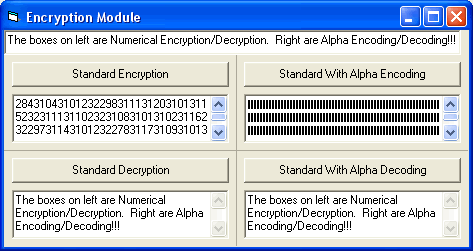

<div align="center">

## \_ Unique Encryption Method


</div>

### Description

Unique way to encrypt a file. I have posted an example of this, put this here just in case people did not feel like downloading it. This is my first encryption method. Wanted to make one that no other method used. So I came up with this. Please leave comments to let me know what you think of this, like I said it is my first so I would really appreciate some feedback. Thanks.
 
### More Info
 


<span>             |<span>
---                |---
**Submitted On**   |
**By**             |[KRYO\_11](https://github.com/Planet-Source-Code/PSCIndex/blob/master/ByAuthor/kryo-11.md)
**Level**          |Intermediate
**User Rating**    |3.6 (51 globes from 14 users)
**Compatibility**  |VB 5\.0, VB 6\.0
**Category**       |[Encryption](https://github.com/Planet-Source-Code/PSCIndex/blob/master/ByCategory/encryption__1-48.md)
**World**          |[Visual Basic](https://github.com/Planet-Source-Code/PSCIndex/blob/master/ByWorld/visual-basic.md)
**Archive File**   |[](https://github.com/Planet-Source-Code/kryo-11-unique-encryption-method__1-50155/archive/master.zip)


### Source Code

```
Public Function Encrypt(StringToEncrypt As String, Optional AlphaEncoding As Boolean = False) As String
 On Error GoTo ErrorHandler
 Dim Char As String
 Encrypt = ""
 For i = 1 To Len(StringToEncrypt)
  Char = Asc(Mid(StringToEncrypt, i, 1))
  Encrypt = Encrypt & Len(Char) & Char
 Next i
 If AlphaEncoding Then
  StringToEncrypt = Encrypt
  Encrypt = ""
  For i = 1 To Len(StringToEncrypt)
   Encrypt = Encrypt & Chr(Mid(StringToEncrypt, i, 1) + 147)
  Next i
 End If
 Exit Function
ErrorHandler:
 Encrypt = "Error encrypting string"
End Function
Public Function Decrypt(StringToDecrypt As String, Optional AlphaDecoding As Boolean = False) As String
 On Error GoTo ErrorHandler
 Dim CharCode As String
 Dim CharPos As Integer
 Dim Char As String
 If AlphaDecoding Then
  Decrypt = StringToDecrypt
  StringToDecrypt = ""
  For i = 1 To Len(Decrypt)
   StringToDecrypt = StringToDecrypt & (Asc(Mid(Decrypt, i, 1)) - 147)
  Next i
 End If
 Decrypt = ""
 Do
  CharPos = Left(StringToDecrypt, 1)
  StringToDecrypt = Mid(StringToDecrypt, 2)
  CharCode = Left(StringToDecrypt, CharPos)
  StringToDecrypt = Mid(StringToDecrypt, Len(CharCode) + 1)
  Decrypt = Decrypt & Chr(CharCode)
 Loop Until StringToDecrypt = ""
 Exit Function
ErrorHandler:
 Decrypt = "Error decrypting string"
End Function
```

